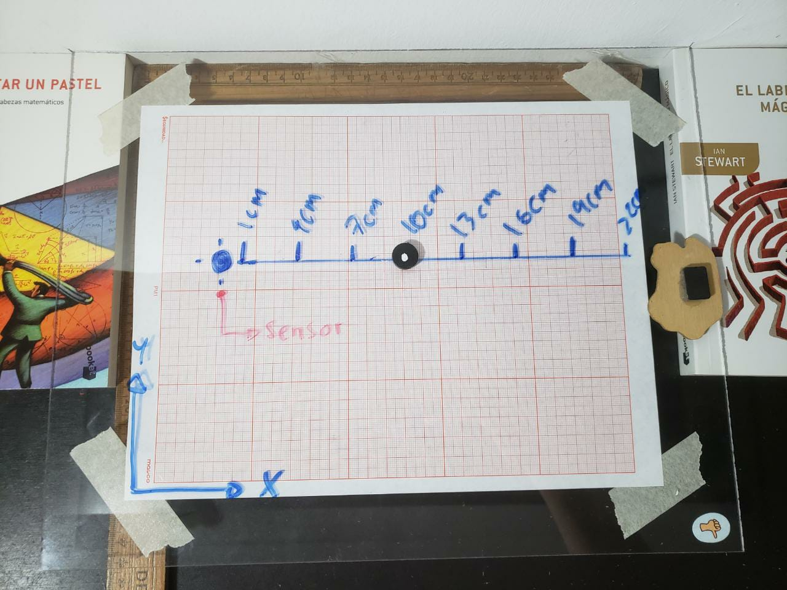

# Campo magnetico de un iman
###### Gabriel Missael Barco, 30/04/2020

Se midió el campo magnetico de un iman utilizando el sensor incluido en un smartphone y la aplicación [Phyphox](https://phyphox.org/), esto unicamente sobre el eje X (ignorando la medición obtenida en Y y en Z). Se realizaron un total de 8 mediciones para dos imanes.

Se busca expresar al campo B como:

$B = Ax^n$

Donde buscaremos a n realizando un ajuste a los datos obtenidos. El montaje experimental fue:

El celular (y por lo tanto, el sensor), estaban debajo de la placa de acrilico.